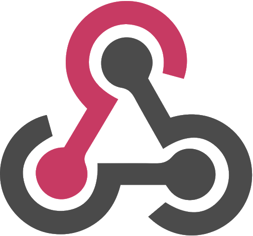
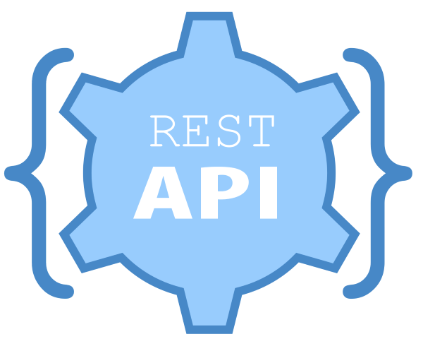
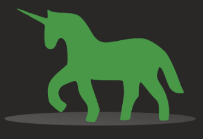

<h2 align="center">ChatBot Bootcamp</h2>

<h3 align="center">A registration bot made for the ChatBot Bootcamp</h3>

------------------------------------------

- This registration bot was made for the `ChatBot Bootcamp workshop` organised by the `KJSCE Codecell`.
- This bot is sort of a demo bot which was taught in the workshop.
- The workshop saw 200 registrations done via this bot and almost 130 such bots were deployed during the workshop in a similar fashion.
- `KJSCE Codecell` is a non-profit council and hence this workshop was free of charge.
- This chatbot was made in less than 24hrs.

------------------------------------------
### Features

- `Register`- It took details and confirmed the registration of the user.
- `Sing`-It was the keyword and initialised a sing along feture of the bot to continue lyrics to the song suggested by the user.
- `Call`- One could call the bot at the no. provided and have a pleasant conversation with it.

------------------------------------------
### Technology Stack

------------------------------------------

------------------------------------------
<h4 align="center">Made by Team  with .</h4>

